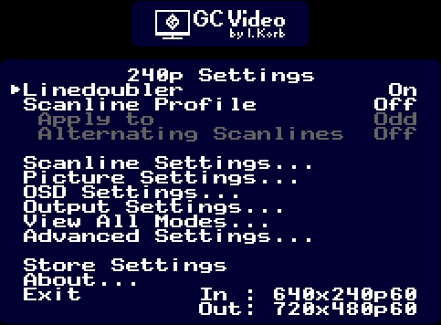
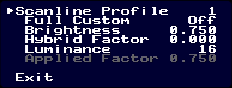
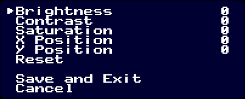
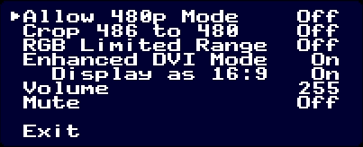
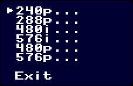
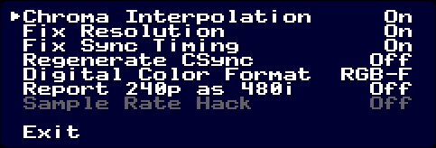
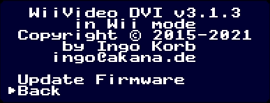

# GCVideo DVI Firmware #

This directory contains the firmware sources for GCVideo DVI.

## List of shame ##

Unfortunately, this needs to be at the top for visibility reasons.

There are now many companies that sell devices based on this open
source project. In the interest of fair competition, I prefer not
to recommend any of these over the others. However, there are some
that I would not consider buying myself due to issues which can
significantly impact the end-user experience.

These are the devices I know of which I would not buy myself:

* **Hyperkin/Armor3 NuView HD**: The firmware of this device is a modified
    version that appears to be based on one of the GCVideo 3.0 releases.
    While the total extent of their modifications is unknown as of this writing,
    the authors seem to have removed the firmware update function completely.
    This will leave users stranded on the included, non-current firmware
    version with no reasonable update path. While the authors seem to have
    eagerly stripped all authorship information from the OSD and changed the
    version number to "0.1", they have left this project's logo and name intact,
    leading to user confusion as it does not match their product's branding
    and no real GCVideo release ever used this version number.
    Preliminary reports on the net indicate that there seems to be no included
    documentation other than a link to a subpage of this Github repository,
    which may be in violation of the license terms of the GCVideo project.

## Building ##

To build the firmware, you will need a Linux or another
Unix system with GNU make, perl and
[ZPU gcc](http://retroramblings.net/?page_id=637).

The firmware can be built in multiple configurations, which only
affects the availability of a few menu options. The choice is
made using the `TARGET` environment variable, e.g. by typing
`make TARGET=gc-dvi`. Supported targets are:
* `gc-dvi`: Digital-only output for a Gamecube console
* `wii-dvi`: Digital-only output for a Wii console
* `gc-dual`: Dual analog and digital output for a Gamecube console
* `wii-dual`: Dual analog and digital output for a Wii console

When building the FPGA bitstream for GCVideo-DVI, a suitable firmware
is compiled automatically.

## Using ##

GCVideo-DVI features an on-screen display for configuring its numerous
settings. It supports navigation using a Gamecube controller or an infrared
remote, depending on the hardware that it is running on

This manual describes all available features of GCVideo, but the hardware you
use may not feature all of them. For example, an internal installation may
not have an IR receiver and an external plug for the digital AV port cannot
access the controller. There are also hardware variants that feature an
additional analog video output connector, which have additional menu options
that do not show up on a digital-only hardware.

### Note about hardware with analog output ###

GCVideo-DV is primarily designed to provide a high-quality digital video output,
but some hardware implementations of it feature an additional analog video
output. This output is strictly treated as a second-class citizen, it cannot
be configured fully independently of the main digital output. For example,
if you enable RGB limited range, this will also affect the signal range
on the analog output if that is set to an RGB mode. When the analog
output is set to YPbPr, it will not be affected by the
brightness/contrast/saturation settings in the picture settings menu.

### Using with a controller ###

The on-screen display only checks the controller in a single port, usually
port 1. It has only been tested with a genuine Nintendo controller and a
Hama clone pad. I have no idea what will happen if you connect one of the more
exotic controllers, for example a Bongo controller. On a Wii, it is recommended
to use an IR remote instead of a Gamecube controller as it has been observed that
the system menu might not enable the controller port if it was empty during boot.

To activate the OSD, hold the L, R, X and Y buttons down until the
menu appears - this should take about one second. If you also hold
down the start button together with these four, all setting will be
reset to their default values.

The OSD is controlled using the D-pad and the X and Y buttons. The X
button activates a menu item, the Y button jumps back to the previous
menu if you are in a submenu or closes the OSD completely if you use
it on the main menu. Please be aware that the Gamecube will still
receive all inputs even when the OSD is active! This can be
problematic for example on the boot screen of the Gamecube because the
cubic menu will rotate due to the D-pad inputs. If you want to use the OSD
on the Gamecube's main menu, you can do so without causing
interference by going into the Gamecube's option menu first.

### Using with an IR remote ###

To keep the code simple, GCVideo only uses six buttons on an IR
remote. The first four of them have been named "Up", "Down", "Left"
and "Right" which allow navigation in the menus just like the D-Pad on
a Gamecube controller. The other two are "Enter" and "Back", which are
used to enter or leave submenus, similar to the X and Y buttons when
a Gamecube controller is used for navigating the OSD.

Since there are no interferences between the IR remote and a game
running on the system, calling up the main menu with an IR remote just
needs a press on the "Enter" button instead of a complicated button
combination. You can also hold down the IR button when you enter the
main menu of GCVideo's OSD to reset all settings except the remote
button assignments to their defaults.

#### IR Button configuration ####

Since I don't know what remote you want to use with GCVideo, it can be
configured to accept any IR remote buttons as long as the remote uses
the so-called NEC protocol. To enter the button configuration screen,
hold down the IR button until the configuration screen appears or select
the "IR key config..." option in the OSD settings submenu.

On the configuration screen, you need to push six buttons on your
remote for each of the functions highlighted on the screen, one after
the other. GCVideo will tell you if you accidentally try to assign the
same button to two different functions. If a button press is not
acknowledged with either "Ok" or "Dupe" on this screen, the remote you
are trying to use may not be compatible (or you have a wiring error
or my code is too strict).

If you want to abort the button assignment, hit the IR button once
to restore your previous button configuration.

The IR remote button assignments are saved together with all the other
settings when you select "Save settings" on the main menu.

### General OSD usage ###

The main menu of GCVideo looks like this:

A indicator on the left side marks the currently-selected menu option.
Lines in white are selectable options, lines in grey are options that are
currently unavailable. The transparency and color of the background color can
be changed in the OSD settings submenu if desired.

Navigating the menu is simple: You can change the current selection using the
up and down buttons, change values using left and right, activate an option
using X on the gamepad or OK on the IR remote and exit using Y on the gamepad
or Back on the IR remote. For options that just toggle between two values
(e.g. "Off" and "On" or "Even" and "Odd") you can also toggle them using the
X button on the gamepad or OK on the IR remote.

The very first line of the main menu (below the logo) is not a menu option but
just shows the detected video mode: 240p, 288p, 480i, 576i, 480p, 576p
or NonStd for non-standard modes. The four menu items just below it provide
quick access to the linedoubler and scanline settings for the current mode -
depending on the mode, some or even all of them may not be available.
These menu entries are explained in the "View all modes" section below.

Most of the menu entries below lead into submenus which are explained in
more detail below. The "Store settings" entry saves all current settings as
new power-on defaults and "Exit" leaves the OSD menu.

If in doubt, experiment with the settings. You can always reset to the
defaults by using L+R+X+Y+Start to call up the OSD menu. This reset
function is temporary - if you want to revert setting that have been
stored, make sure to use the "Store settings" menu item.

The OSD has one additional function outside of the main menu: When
the resolution of the video signal from the Gamecube changes, an information
popup shows the new information in the top right corner for five seconds.
This popup can be disabled in the "OSD Settings..." submenu.

### Scanline Settings ###

GCVideo can optionally darken parts of the image to simulate the appearance
of scanlines on a CRT display. To allow more flexibility, there are three
scanline profiles that you can assign to the supported video modes as you
like and you can customize each of the profiles as needed.

Scanlines in GCVideo 3 are a bit more flexible than the previously used
algorithm that just reduced the brightness by a constant factor. The new
algorithm chooses the factor based on the luminance of the original pixel
that is processed, so a blooming-like result can be achieved by weakening the
scanline effect in bright parts of the picture.

The first line in the menu selects which scanline profile is changed using
the settings below it. If the selected profile is the same one that is used
for the current mode, it is marked with a * on the right side and
all changes will be visible immediately.

The "Full Custom" option is meant for people who want to have extremely
fine-grained control over their scanline profiles. When it is off, the
appearance of the scanlines are controlled only by the "Brightness" and "Hybrid
factor" options below. When "Full custom" is on, these two entries are disabled
and you can instead select an individual scanline brightness for each possible
luminance value.

To simplify the explanation, let us assume that the "Hybrid Factor" is set
to 0.000 for now. In this case, the appearance of the scanline effect is
independent of the luminance of the input pixel, so both a bright and a dark
input pixel are darkened by the same factor. This factor is determined by
the "Brightness" menu entry which has a range from 0.000 to 1.000. A factor
of 0 will turn every affected pixel to black and a factor of 1.000 will leave
it as it is, effectively disabling the scanline effect. Factors between these
limits darken the pixels proportionally.

The "Hybrid Factor" menu entry ranges from 0.000 to 1.992 and determines how
much the scanline effect is weakened for bright pixels in the image. As stated
above, at 0.000 the hybrid factor is disabled. When set to 0.5, the strength
of the scanline effect is reduced by half for the brightest pixels and it
completely disappears for them when the hybrid factor is 1.000. Hybrid factors
above 1.000 move the point where the scanline effect disappears towards darker
pixels, at the maximum of 1.992 pixels at about half brightness are not
affected by scanlines anymore.

The hybrid factor implementation is inspired/adapted/stolen-with-permission
from the hybrid scanlines of the OSSC by Marqs and borti, but the image may
look slightly different due to implementation differences.

The "Luminance" menu item is always active independent of the "Full Custom"
option. Its value can range from 16 to 235 and determines which factor is
accessed/shown in the "Applied Factor" menu item. With "Full Custom" set to
off, this can be used to check the table of scanline strengths that is
calculated by the "Brightness" and "Hybrid Factor" menu options.

When "Full Custom" is set to On, the last menu item "Applied Factor" becomes
available. Together with the "Luminance" menu item, you can edit every single
entry in the strength table that GCVideo uses to implement the scanline
effect. The value here works the same as the "Brightness" value when "Hybrid
Factor" is set to 0.000, but it only affects pixels that have the luminance
value set in the "Luminance" menu item. Even though you can only see a single
value in this menu at a time, there is a full table with entries for all
luminances from 16-235 that you can edit here one entry at a time.
Of course it would be much better to edit a table like this in graphical form,
but unfortunately this would require too many FPGA resources to implement
in GCVideo.

Please note that turning "Full Custom" off and changing either of the
"Brightness" and "Hybrid Factor" will reset the custom table back to calculated
values. Both fully-custom as well as normal scanline profiles can be saved
togetierh with all the other settings by selecting "Store Settings" in the
main menu.

### Picture Settings ###

The Picture Settings submenu has controls to change the brightness,
contrast and saturation as well as the position of the picture.

Each of the controls has a range from -128 to +127. When brightness,
contrast and saturation are all set to 0, the picture is output exactly as
produced by the console, without any modification.

As these settings also affect the appearance of the on-screen display and
it is possible to set them to values that makes the OSD completely unreadable,
the Picture settings menu operates slightly differently than the other menus:
Although all changes are applied immediately, they are reset to their previous
value if you exit the menu using the Y or Back button or the "Cancel" option.
To keep your changes, you need to select the "Save and Exit" menu option.
This applies only to the current session - to permenently save the picture
settings as well as all other settings, select "Store settings" in the
main menu.

Please note that some extreme combinations of settings in this menu
can result in errorneous color output, e.g. bright white flipping to
black or shifted tint in highly-saturated colors. If you encounter
this, the recommended workaround is to use less extreme picture
settings in GCVideo, prefereably neutral.

The "X Position" and "Y Position" settings change the position of the game
image on screen. Althogh their range is from -128 to +127, the actual position
of the image is constrained by the video signal generated by the console.
For some games or software it may not be possible to shift the image at all
even if you choose a non-zero setting here. This setting is also ignored for
non-standard video modes.

When one of GBI's 486 line video modes is detected and "Crop 486 to 480" in
the Output Settings is enabled, you can use the "Y Position" setting to
move the 480 line window that GCVideo shows within GBI's 486-line signal.

### OSD Settings ###

The OSD settings menu has an option to disable the mode popup that shows for
five secends whenever the console changes its output resolution as well
as three settings to change the color and transparency of the OSD background.

The "BG Transparency" determines how much the console's image shines through
the OSD and has a range from 0 to 255. At 0, the console's image is not
visible at all through the OSD background and at 255 the console's image is
fully visible, which may lead to readability issues if the image behind the
OSD is very bright. The default value is 80.

"BG Tint Blue" and "BG Tint Red" determine the color of the OSD's background.
Technically it is a Cb+Cr value in the YCbCr color space, but in practice
it is probably easier to experiment with the values to reach the desired
color. The defaults are 27 and -8, which result in a dark blue background.

As usual, the settings chosen in this menu can be stored as power-up default
using the "Store settings" entry on the main menu.

Additionally, you can enter the IR button configuration screen from this
menu by selecting the "IR Key Config..." entry.

### Output Settings ###

This menu contains various output-related settings. The defaults are chosen
for maximum compatibility, not maximum convenience, so you will probably want
to change some of them.

"Allow 480p Mode" determines if GCVideo signals the presence of a progressive
video cable to the console. If this option if turned off on a Gamecube,
games will never ask you if you want progressive mode(*); if it is turned off
on a Wii, the 480p mode option will not be available in the console's setting.
If you use a display that only supports standard definition, it may be useful
to turn this option off as some homebrew software defaults to 480p when it
detects the presence of a progressive mode video cable. On some hardware
implementations the presence signal is always enabled, no matter what is
set here.

"Crop 486 to 480" is a special option to generate a standard 480-line image
from GBI's 486-line video modes. As long as it is disabled, GBI's special
486-line modes are passed through as-is. If it is enabled and one of the
special modes is detected, the image is cropped to 480 lines, which improves
compatibility with some displays.

"RGB Limited Range" determines if GCVideo outputs a limited range ("On")
or full range ("Off") RGB signal on its digital output. This option may be
disabled if YCbCr output is selected in the advanced menu. Please check the
glossary below for an explanation about limited- and full-range RGB signals.
It defaults to full range as the default output is standard DVI, which is
always full range.

"Enhanced DVI Mode" chooses if the digital output transmits standard DVI ("Off")
or an enhanced version that contains additional metadata and audio signals,
which is not compatible with strictly-conforming DVI inputs. The default
for this option is Off, because it is easier to turn it on if you do not get
any audio than turning it off when you do not get any picture.

When "Enhanced DVI Mode" is On, the "Display as 16:9" option becomes available.
If turned on, it tells the display that the signal should be shown in a 16:9
aspect ratio. Some displays (and scalers) respect this setting and automatically
change their aspect ratio between 16:9 and 4:3 depending on the setting, some
ignore it.

"Volume" reduces the audio volume, with a range from 0 (silent) to 255
(original signal). This setting only affects the audio from GCVideo's own
output, not from the Multi-AV of the console. "Mute" below it can be used to
temporarily mute the console's audio without having to dial down through
the full range of the volume setting.

Hardware implementations that feature an additional analog video output
show a menu item "Analog Output" here that is used to select the analog video
signal format. "YPbPr" outputs component video, "RGB" outputs RGB and
"RGsB" outputs RGB with sync-on-green. Please note that certain settings
in the Advanced Options menu may stop RGB/RGsB from working.

As usual, the settings chosen in this menu can be stored as power-up default
using the "Store Settings" entry on the main menu.

(*) Please note that most PAL-region Gamecube games do not offer a progressive
video option at all. For NTSC-region games, you may need to hold B while the
game is booting to make the question about progressive mode show up. Third
party software like [Swiss](https://github.com/emukidid/swiss-gc) can sometimes
force PAL-region games to output progressive video.

### View All Modes ###

As mentined before, the first four entries on the main menu screen are
specific to the current video mode. Since it would be inconvenient to cycle
through all modes on the console just to configure each one of them, the "View All
Modes" menu lets you select which mode's settings you want to change.
Since it is not possible to change any of these settings in Non-Standard modes,
there is no NonStd-entry in the mode menu.

The per-mode menu has an entry to enable or disable the line doubler as
well as settings related to scan lines. Depending on the mode, some settings
may be disabled.

"Linedoubler" is available in 240p, 288p, 480i and 576i. If enabled, GCVideo
outputs each video line twice, which results in an output of 480p or 576p.
It is enabled by default for all modes to improve compatibility, but if your
display accepts 480i/576i modes over a digital connection, it is recommened
to turn the linedoubler off for these modes because that will likely result in a
higher image quality. For more details about linedoubling vs.
deinterlacing, check the glossary.

The scanline options are only available in 480p and 576p modes or if the
linedoubler is enabled for the 240p/288p/480i/576i modes. To disable
scanlines, just set "Scanline Profile" to "Off". Otherwise, the chosen profile
is applied to the image according to the settings below it.

"Apply to" chooses if scanlines are applied on the odd or even video lines and
enabling "Alternating Scanlines" swaps between even and odd video lines every
frame. By enabling the linedoubler for 480i/576i and turning on alternating
scanlines at a moderate strength, you can sometimes achieve a CRT-like effect
for interlaced video.

As usual, the settings chosen in this menu can be stored as power-up default
using the "Store Settings" entry on the main menu.

### Advanced Settings ###

The settings in this submenu are meant for advanced users only because they can
reduce audio and/or image quality or reduce compatibility of the output signal
with displays. On the other hand, changing some settings here may allow you to
use a display that refuses to cooperate with the default settings, although
possibly at reduced output quality.

"Chroma Interpolation" is on by default. If you turn it off, the output image
will have a slight color shift as well as stronger staircasing/pixelation
on color transitions.

"Fix Resolution" is on by default. When it is on, GCVideo applies black borders
to the console's image to extend it to a standard-conforming resolution. Many
games output a picture at a slightly reduced resolution as the edges of the
image are usually not visible on a CRT display and not rendering there saves
a bit of graphics power. By disabling this option, the output signal of GCVideo
no longer conforms to the relevant standards, which may cause issues with some
displays or scalers - for example one of my TVs always scales such signals to
the full panel size and disables its aspect options.

"Fix Sync Timing" is on by default and is only available while "Fix Resolution"
is turned on. It modifies the timing of the sync signals to be
standards-compliant. There is little reason to turn this off, it is here
mostly for completeness reasons. If this option is off, the X/Y position
options in the picture menu have no effect.

"Regenerate CSync" is off by default and only relevant for hardware with an
analog output. It determines if the CSync signal (either discrete or included
in Y for YPbPr or G for RGsB) is passed through from the console while the
linedoubler is off or if it is always regenerated from HSync and VSync.
A regenerated signal does not have serration and equalization pulses, which
may result in a distortion at the top of the picture. The X/Y position options
in the picture menu may not have an effect on the analog output of this
option is set to off.

"Digital Color Format" is only avaiable if "Enhanced DVI Mode" is enabled
in the output settings menu. When it is available, the options are "RGB-F",
"RGB-L", "YC444" and "YC422". The first two stand for full-range and
limited-range RGB and have the same effect as the RGB limited range toggle
in the output menu. The last two options select YCbCr output with 4:4:4 or
4:2:2 chroma downsampling (see glossary for details) and may not be
compatible with all displays. There are even some displays that accept
YCbCr colors in some modes, but not others. Choosing YC444 or YC422 here may
result in incorrect colors on the auxiliary analog output (if available).

"Report 240p as 480i" is off by default. As 240p/288p modes are less common
as digital signals, some displays may not recognize their official mode numbers.
Turning this option on changes the metadata that is sent when a non-linedoubled
240p/288p mode is displayed: Instead of sending the correct mode numbers,
GCVideo uses the ones for 480i/576i instead. I'm not sure if this useful in
practice - it was an attempt to get one of my displays to accept metadata in
240p mode, but it was not successful.

"Sample Rate Hack" is off by default and only relevant if the console is a
Gamecube or a Wii in Gamecube mode. Due to an off-by-one bug in the console's
hardware, the audio sample
rate of a Gamecube is not a standard 48.000Hz rate, but instead 48.042Hz.
This is still (barely) within the official tolerance for SPDIF, but there
have been reports of audio/video drift after longer times which may be caused
by this difference. If you turn this option on, the output sample rate is
forced to be exactly 48.000Hz by occasionally dropping a sample, which
introduces slight fuzzing or crackling artifacts which may or may not be
audible depending on the sound that is playing. If you have turned this
option on, please do not file any bugs about distorted audio.

As usual, the settings chosen in this menu can be stored as power-up default
using the "Store Settings" entry on the main menu.

### About ###

The about screen shows the firmware version, current console mode (on Wii) and
has an option to boot into the firmware update tool, which is described below.

## Updating ##

GCVideo includes a tool for flashing updates that can be accessed
either by choosing the "Update Firmware..." option in the About menu
or by holding the IR button while turning on the console.
The update tool will also be automatically started when GCVideo detects
that the main firmware is corrupted or missing.

While the update tool is running, GCVideo runs in a restricted mode
that offers only minimal features and almost no configurability:
* the image is always in black and white
* there is no audio
* the digital output always outputs a 480p/576p image, using linedoubling if
    the console is using a 480i/576i mode
* the analog output (if available) always outputs a 480i/576i image
* the analog output (if available) always outputs a component video signal,
    but it will probably still result in a visible (but weirdly-colored) picture
    if you use an RGB connection
* settings made in the main firmware are ignored, except for the IR remote
    button codes
* no user-configurable options exist except for the IR remote configuration menu
    which can be activated by a long press of the IR button as usual

To use the update tool, you need to be able to run homebrew software in .dol
form on your Gamecube or Wii. It does not matter if you start the .dol with
the firmware update before or after entering the flash tool.

The flash tool continuously scans the video signal for valid update data.
If it finds an update that is applicable to your installed hardware, it
asks if you want to install it, showing the version numbers of the current
firmware and the one that it can install for you.

To actually install the firmware when prompted, hold the X and Y buttons on
the gamepad or push the OK button on the IR remote. After the update is
installed, GCVideo will automatically restart. If you want to exit the
flash tool without installing an update, push the start button on the
gamepad or the Back button on the IR remote.

In theory, it should not be possible to brick GCVideo by installing a
firmware update, even if the power fails during installation: Even if the
main firmware does not start, you can always force a start of the flash
tool by holding down the IR button when powering on the console.
In practice it is an observed phenomenon that theory and practice can differ,
so there are no guarantees that everything will work as described here.

## Diagnostics mode ##

The firmware update mode also includes a diagnostics tool that can be used
to check that certain aspects of a GCVideo installation are wired correctly.
It is accessed by choosing the "Update firmware..." option in the About menu
and hitting the R trigger on a Gamepad or Right on an IR remote. It is
currently only usable if you get a picture at all.

The diagnostics mode checks if all eight video lines are working and if there is
activity on the three audio lines. The video line check needs a special test
pattern on screen which is integrated in the updater.dol starting from
GCVideo-DVI version 3.0d, a specific color gradient at the top of the screen.
The audio line check just needs any audio playing, for example the background
music of the console's main menu screen. The updater.dol plays an
extremely quiet white noise starting from GCVideo release 3.0e
(updater version 1.2) to make sure this signal can be tested.

When the diagnostics mode has detected the test pattern, it will confirm by
displaying "Test pattern detected". If everything is correct, the three lines
just below should all say "None". If not, they will show the number(s) of the
VData line(s) which appear to have issues. Lines listed as "stuck at 0/1" are
likely unconnected or shorted to an unrelated signal. Anything listed in
"Unexpected bits" may be swapped or shorted with another line or an unrelated
signal.

Please note that the "Unexpected bits" output is almost certain to be "01234567"
even with a fully working install if the test pattern is not shown on screen.
The "Bits stuck" test may still give a valid result even without the test
pattern, but it is known to result in misdetections depending on the screen
content - for example, a fully black screen may mistakenly detect "0123 56" in
the "stick at 0" diagnostic.

The audio diagnostic checks if the three audio signals are toggling and if
they have unexpected glitches, e.g. due to crosstalk. If a signal is
not toggling at all, it will be listed as "Missing" - but please note that
this will also be shows for AData if the audio from the console is silent.

If glitches are detected, the number of glitches per frame is shown in
parenthesis - for AData, even a perfect install may show a small number of
glitches due to unknown circumstances. Glitches can result from interference
between multiple signals, re-routing the wires with more separation or
just with a different angle between them can sometimes have a major effect on
the number of detected glitches.

## Glossary ##

This section contains explanations about some concepts that are
relevant to GCVideo, but are too verbose to explain directly in the
main manual section.

### Full- and Limited Range RGB ###

For historical reasons there are two interpretations of RGB color
values that are sent over a digital interface. One interpretation is
to use 0 as black and 255 as the brightest red/green/blue. This
variant originates from the usage in computer graphics and is called
_Full Range RGB_ because it uses the full range of numbers.

The other interpretation uses 16 as black and 235 as the brightest
red/green/blue - values below/above that are usually shown as black or
brightest red/green/blue. This may look weird, but it derives from the
formulas that are used to convert the YCbCr color space to RGB and is
thus commonly used in broadcast video. It is called _Limited Range
RGB_ because it only uses a limited range of the possible numeric
values.

GCVideo can output either of them, which one you should choose depends
on the expectations of the receiving side. If you choose wrong, the
contrast of the picture changes: Sending full range RGB to an input
that expects limited range looks like a higher-contrast picture at
first, but both the darkest and brightest parts of the image will lose
detail because they exceed the range of allowed values. In the other
case where a limited range signal is sent to an input expecting full
range, the contrast is lowered, which does preserve detail in all
areas but looks washed-out.

In theory this choice would not matter when the Enhanced DVI option is
turned on as there is a bit in the video information data that tells
the receiver if the image is supposed to be full- or limited range. In
practice, not every receiver checks that bit, so on some
displays/scalers/etc it is neccessary to manually select the RGB range
in its menus. The naming of the option may not always be obvious, for
example some Samsung TVs call it "HDMI Black Level", with "Low"
meaning limited range and "Normal" meaning full range.

Which of the two options you choose does not really matter as long as
the receiving side uses the same choice. If you have a display that
requires a manual choice and you feed it through an HDMI switch, you
probably want to make sure that all sources connected to that switch
use the same setting - be aware though that some sources do not allow
you to make this choice, for example a Wii U always outputs limited
range RGB over its HDMI output.

### Linedoubling vs. Deinterlacing ###

Linedoubling is a relatively simple process: Each input video line is output
twice, at twice the speed. This doubles the vertical resolution and is very
simple to implement as only two lines must be stored. However, it is a very
ugly method when applied to interlaced material because it results in a
flickering and jittering picture. On the other hand, a flickering and jittering
picture is still better than no picture at all, especially since the Gamecube's
system menu always outputs an interlaced picture.

To properly generate a progressive signal from
an interlaced one, a deinterlacer would fill the newly-generated lines not with
a copy of the preceding line, but instead with data from the previous field.
However, this requires more memory because at least the entire previous field
must be stored. [Wikipedia](https://en.wikipedia.org/wiki/Deinterlacing) has
a more detailed discussion of Deinterlacing.

### 4:2:2 and 4:4:4 color ###

These two number groups specify the color resolution relative to the
brightness resolution of a video signal. 4:4:4 means that every single
pixel has both its own brightness and color data and 4:2:2 means that
every pixel has its own brightness, but color data is shared by groups
of two pixels. This is called [Chroma
Subsampling](https://en.wikipedia.org/wiki/Chroma_subsampling) and
there are further variants beyond these two that are not relevant for
GCVideo.
