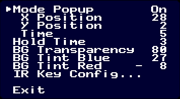

# GCVideo #

## This fork adds four extra settings to the OSD menu
- "X Position" and "Y Position" move the resolution popup box.
- "Time" changes how many seconds the popup box is displayed.
- "Hold Time" controls how quickly the GCVideo menu appears.  
Increase to fix the 8bitDo Bluetooth receiver compatibility.

GCVideo is a small series of FPGA boards and VHDL projects
capable of converting the
GameCube's Digital Video port signals to standard video signals
without using the custom chip in the original component video cable.
There are currently VHDL projects for multiple FPGA boards, including
a Gamecube-to-DVI version for the KNJN Pluto IIx-HDMI and a
Gamecube-to-Component/RGB version for a board called GCVideo Lite
which is also documented in this repository.
GCVideo Lite has also been adapted to be used as
an RGB DAC for the Nintendo 64.

The schematics and layout are in the [Hardware](Hardware) directory
and the HDL projects are in the [HDL](HDL) directory. Each directory
should contain README.md files with further information.

## Mini-FAQ ##

1. I want one, how much is it?  
    I do not sell any hardware. Since this is an open-source project,
    other people will probably offer ready-made boards or modding
    services.

    GCVideo-DVI is based on a readily-available, commercial FPGA
    development board, so you could just buy that, flash it and
    install it yourself (or find someone to do it for you).

1. But why don't you just sell it?  
    Building hardware to be sold is a lot of work and requires much
    time that I'd rather use for something more
    interesting. Furthermore, the local laws require quite a bit of
    paperwork and investment to legally sell electronic devices that
    you build and I'd prefer not to deal with all of that.

1. You said your prototype came from OSHPark, so you have at least
    three boards. Can't you sell me one of them?  
    No, they're all accounted for already.

1. Why did you use that weird Video-DAC, it's a non-stock part at
    Digikey! 
    It wasn't when I designed the board some months ago... Instead it
    was the cheapest 24-bit video DAC available. It shouldn't be hard
    to adapt the design to a different DAC as long as it has 24 bit
    parallel input and a single-pumped clock. For YPbPr output, the
    DAC also needs to be able to generate a small offset on the Y line
    so that syncs can be generated below the blanking level.

1. Uh, it says XO2-256 in the schematic, but XO2-640 in the BOM. Which
    is the correct one?  
    The original plan was to use an XO2-256, but adding the color
    space conversion for RGB output increased the size of the design
    too much. It was left as an XO2-256 in the schematic to ensure
    only pins available on that chip are used, so a slightly cheaper
    Component-only version can be built.

1. What about line-doubling?  
    GCVideo Lite (the analog version) uses the smallest FPGA that
    could fit everything needed, but this chip does not have enough
    BlockRAM available to generate a line-doubled picture. It could be
    updated by using a larger, footprint-compatible FPGA, but since
    480i/576i are well-supported on component inputs and 240p/288p are
    rarely used by Gamecube titles this has not been attempted yet.

    GCVideo DVI fully supports line-doubling and can also overlay
    scanlines on the line-doubled picture if desired.

# Licence #

<pre>
Copyright (C) 2014-2021, Ingo Korb &lt;ingo@akana.de&gt;
All rights reserved.

Redistribution and use in source and binary forms, with or without
modification, are permitted provided that the following conditions are met:

1. Redistributions of source code must retain the above copyright notice,
   this list of conditions and the following disclaimer.
2. Redistributions in binary form must reproduce the above copyright notice,
   this list of conditions and the following disclaimer in the documentation
   and/or other materials provided with the distribution.

THIS SOFTWARE IS PROVIDED BY THE COPYRIGHT HOLDERS AND CONTRIBUTORS "AS IS"
AND ANY EXPRESS OR IMPLIED WARRANTIES, INCLUDING, BUT NOT LIMITED TO, THE
IMPLIED WARRANTIES OF MERCHANTABILITY AND FITNESS FOR A PARTICULAR PURPOSE
ARE DISCLAIMED. IN NO EVENT SHALL THE COPYRIGHT HOLDER OR CONTRIBUTORS BE
LIABLE FOR ANY DIRECT, INDIRECT, INCIDENTAL, SPECIAL, EXEMPLARY, OR
CONSEQUENTIAL DAMAGES (INCLUDING, BUT NOT LIMITED TO, PROCUREMENT OF
SUBSTITUTE GOODS OR SERVICES; LOSS OF USE, DATA, OR PROFITS; OR BUSINESS
INTERRUPTION) HOWEVER CAUSED AND ON ANY THEORY OF LIABILITY, WHETHER IN
CONTRACT, STRICT LIABILITY, OR TORT (INCLUDING NEGLIGENCE OR OTHERWISE)
ARISING IN ANY WAY OUT OF THE USE OF THIS SOFTWARE, EVEN IF ADVISED OF
THE POSSIBILITY OF SUCH DAMAGE.
</pre>
